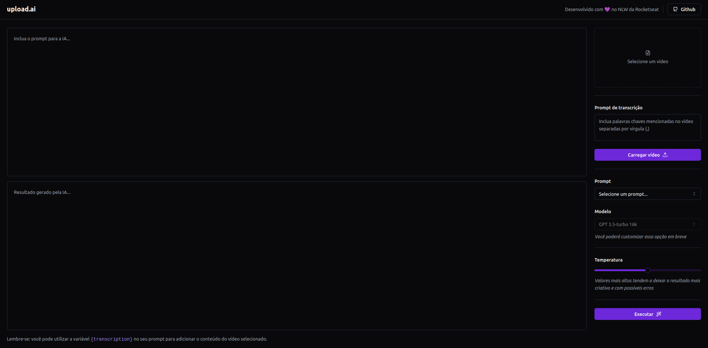

  

## This project was developed during the event NLW IA from Rocketseat

---

### 📷 Preview

---

### 💻 Description

It's a website connected to an api in node.js that can upload video, convert to audio and transcript the entire video using an AI. After that you can choose a prompt (YouTube title or description) to ask to the AI generate based on the content of the video.

---

Developed by [ricardorhv](https://github.com/ricardorhv) 👋
